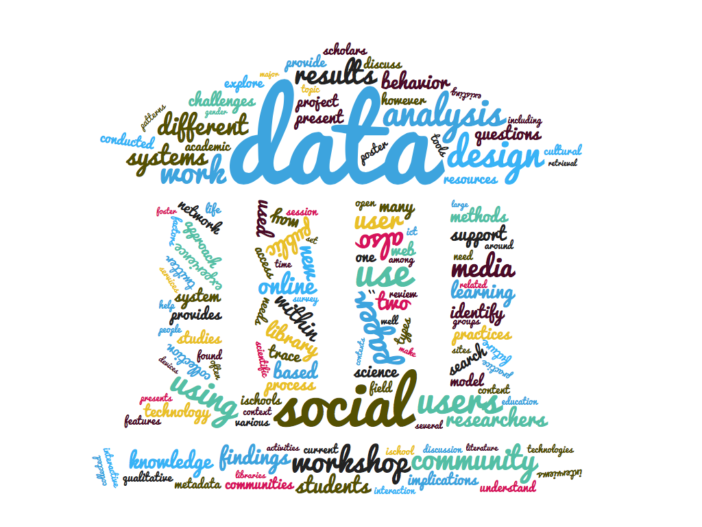

# CKM-lec-task_2-Yawen_Zhang

## Task 2 & ddl

https://moodle.hu-berlin.de/mod/assign/view.php?id=1101462

Task 2 due Friday 01 July 2016

a: (for those with some programming background) Execute (or write) a Python program to extract information from one of the files in the Python folder. Upload the program you used and the results. Indicate what file was used. Due Friday 3 July 2015

b: (for those with no programming background): Take one of the sample programs and describe in words exactly what it does when reading multiple texts. (NOTE: a similar exercise was on the exam last year)

ddl: **Friday, 1 July 2016, 12:00 AM**

## iConference-2015 as an example

### 0 Code, notes and outputs
<mark>**see `main.ipynb`**</mark>

### 1 Word cloud of abstracts

### 2 Author frequency

### 3 Country frequency

### 4 Keywords frequency (freq > 2)

### 5 Region frequency

### 6 Type frequency

